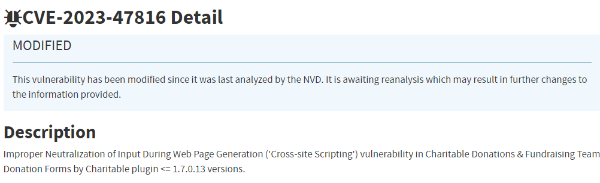
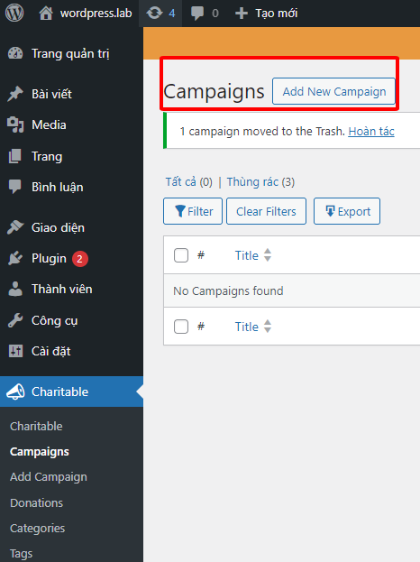
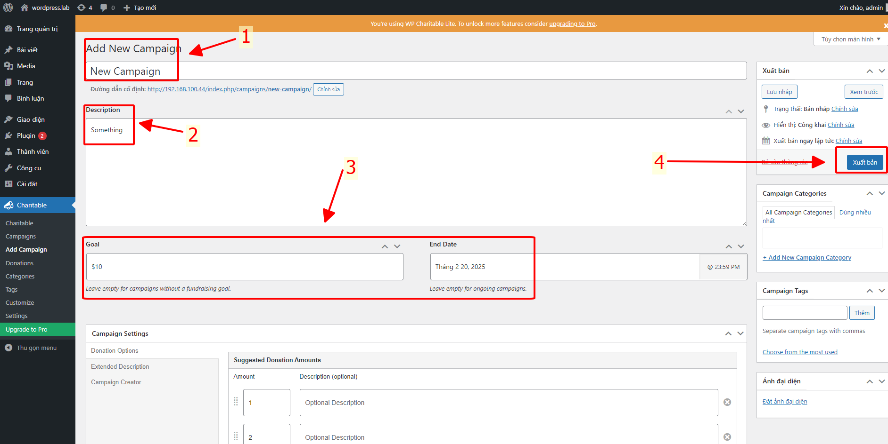
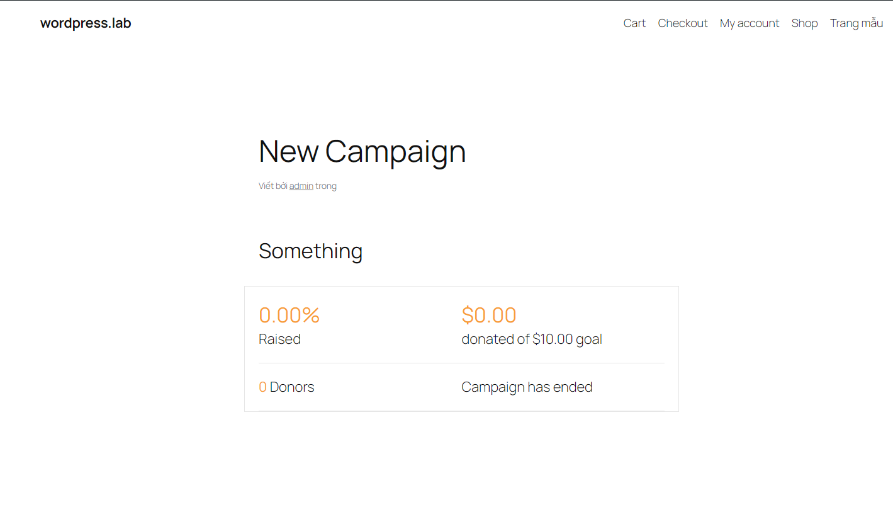
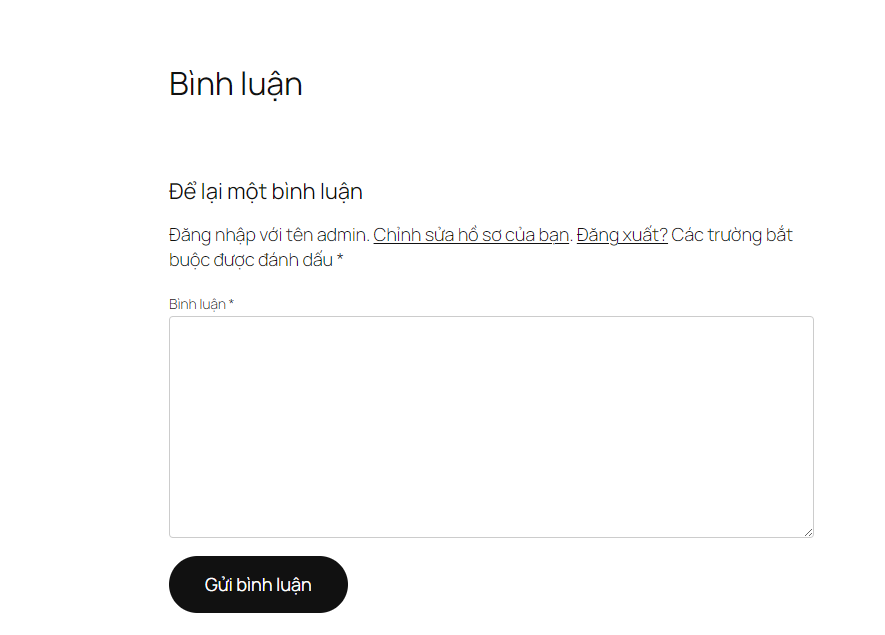
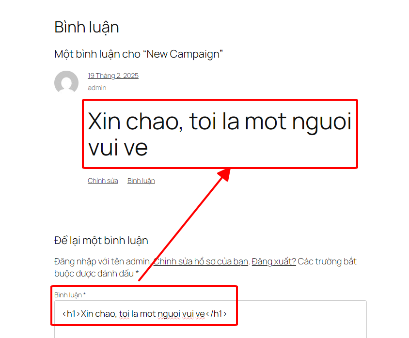
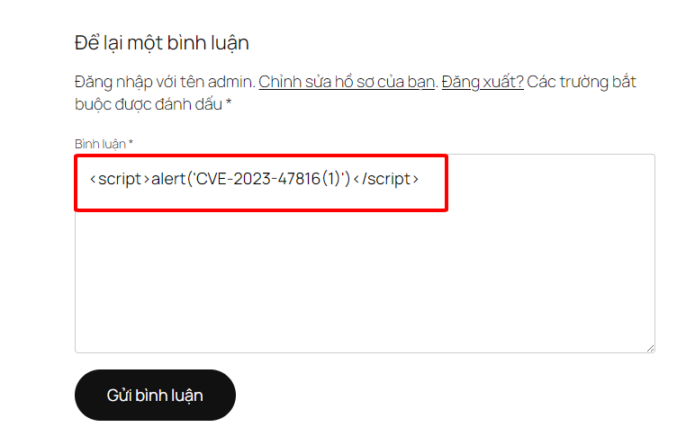
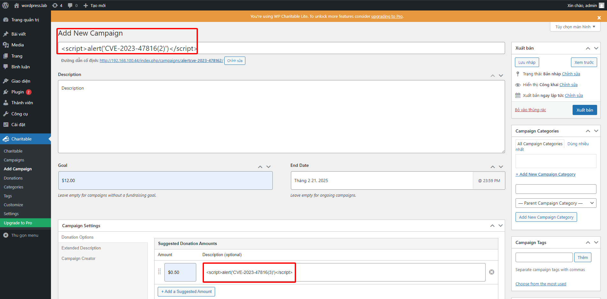
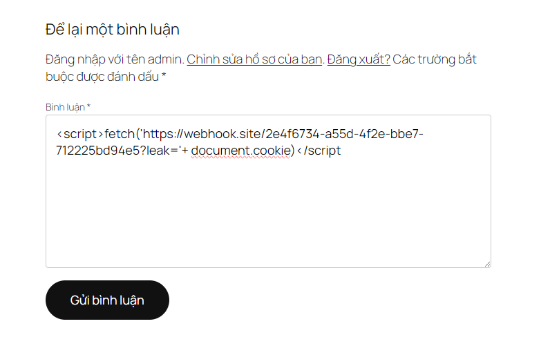
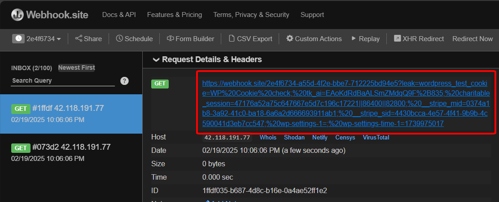

# CVE-2023-47816
-----
Xin chào các bạn, mình đang trong quá trình học cách phân tích 1-DAY của CBJS thì vô tình mình nhặt CVE này của một người mình quen biết để dựng lại PoC, tuy nhiên mình vẫn chưa phân tích được RootCause vì mình chỉ mới làm quen với WordPress, có thể sau này phân tích được RootCause thì mình sẽ tiếp tục Update.

## I/ Tìm hiểu về CVE-2023-47816

*Research CVE trên site NIST.gov hoặc CVEMitre*

Sau khi biết được CVE này là của plugin Charitale < 1.7.0.13> thì mình cũng đã tìm và download source code của plugin này về và kích hoạt nó trong WordPress.

Mình xem sơ thì thấy plugin này trông giống như được sử dụng để kêu gọi quyên góp cho mục đích gì đó.

Thử `Add New Campaign`

Sau đó `xuất bản` nó. Xem thử nó có thể làm gì.

*Khi click vào `xem` thì sẽ hiện ra Campaign vừa tạo*

Khi lăn xuống phía dưới, nhận thấy có tính năng `Comment`

## II/ Guess and Test case

-> Thử xem nó có thể nhận và xử lý các tag html không? Thử với tag \<h1>

Và nó đã xử lý tag \<h1>

Tiếp tục đưa vào với tag \` -> Khúc này mình nghĩ nó sẽ không dính hoặc là plugin này đã xử lý tag script thành plain text. 

Nhưng chưa thử mà, thử truy cập xem CamPaign

.png)

## III/ Exploit

Nãy giờ chỉ là tìm ra các chỗ bị thôi, giờ mình sẽ exploit bug này bằng cách `fetch đến webhook cùng với cookie của admin`. Mình chọn phần comment để làm vì nó nhanh hơn cách tạo Campaign mới.

Chuyển sang tab Webhook -> Nhận thấy có gói tin được bắn sang

## IV/ Conclusion

Plugin này xoay quanh việc tạo Campaign và Donate, mà plugin đã không xử lý tốt việc santize các tag html dẫn đến việc bị lợi dụng để thực thi Javascript. Mình cũng có phân tích sơ qua thì có vẻ như plugin này có hàm `esc_html` chịu trách nhiệm santize các tag html nhưng có vẻ những `trường ` nhận input từ người dùng cần được santize không rơi vào hàm này.
